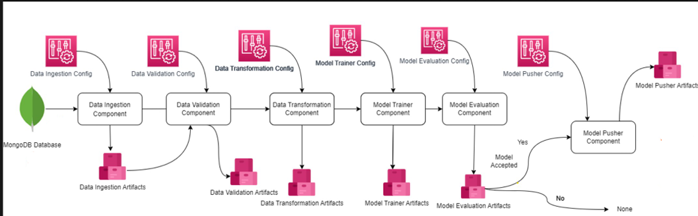

# ⚡ Network Security — ML Pipeline for Threat / Phishing Detection

<p align="center">
  <a href="https://www.python.org/">
    
  </a>
  <a href="https://www.docker.com/">
    
  </a>
  <a href="https://aws.amazon.com/">
    
  </a>
  <a href="https://fastapi.tiangolo.com/">
    
  </a>
  <a href="https://mlflow.org/">
    
  </a>
</p>
[] 
[] 
[] 
[] 
[]

**End-to-end ML pipeline for detecting phishing threats in network data.** Fully Dockerized, with CI/CD, AWS cloud sync, and FastAPI endpoints for real-time predictions.

---

## Highlights

- **Automated ML Pipeline:** Ingestion → Validation → Transformation → Training → Cloud Sync  
- **Models:** RandomForest, DecisionTree, GradientBoosting, LogisticRegression, AdaBoost  
- **Guardrails:** Accuracy ≥ 0.60, Generalization gap ≤ 0.05  
- **Experiment Tracking:** F1, Precision, Recall via MLflow  
- **Cloud Ready:** Artifacts & models auto-uploaded to S3, Dockerized for deployment  
- **API Endpoints:**  
  - `POST /train` → trigger training pipeline  
  - `POST /predict` → upload CSV and get predictions  
  - `POST /upload` → simple file upload form


---
## 📊 Snapshots  

 


## Repository Structure

```text
Network-security/
├─ networksecurity/
│  ├─ components/
│  │  ├─ ingestion/
│  │  ├─ validation/
│  │  ├─ transformation/
│  │  └─ training/
│  ├─ pipeline/
│  │  └─ training_pipeline.py
│  └─ cloud/
│     └─ s3_syncer.py
├─ data_schema/
│  └─ schema.yaml
├─ final_model/
├─ saved_models/
├─ Artifacts/
├─ app.py
├─ Dockerfile
├─ requirements.txt
└─ .github/
   └─ workflows/
      └─ workflow.yml


---

## Quick Start

### Setup
```bash
python3 -m venv .venv
source .venv/bin/activate
pip install --upgrade pip
pip install -r requirements.txt

Environment Variables:

MONGO_DB_URL=<mongodb-connection-string>
MONGODB_URL_KEY=<mongodb-connection-string>

Run API
python app.py

Access docs: http://localhost:8000/docs
/train → run full training pipeline
/predict → upload CSV, get predictions

Docker:
docker build -t network-security:latest .
docker run -e AWS_ACCESS_KEY_ID=$AWS_ACCESS_KEY_ID \
           -e AWS_SECRET_ACCESS_KEY=$AWS_SECRET_ACCESS_KEY \
           -e AWS_DEFAULT_REGION=$AWS_DEFAULT_REGION \
           -p 8000:8000 network-security:latest

☁️ Cloud & CI/CD:

Artifacts → s3://sannynetworksecurity/Artifacts/<TIMESTAMP>
Models → s3://sannynetworksecurity/final_model/<TIMESTAMP>
GitHub Actions builds Docker image & pushes to Amazon ECR

🏗 Roadmap:

Unit tests & CI integration
Richer evaluation metrics (ROC-AUC, confusion matrix)
Parameterized AWS S3 bucket & ECR repo
ECS/EC2 deployment with autoscaling